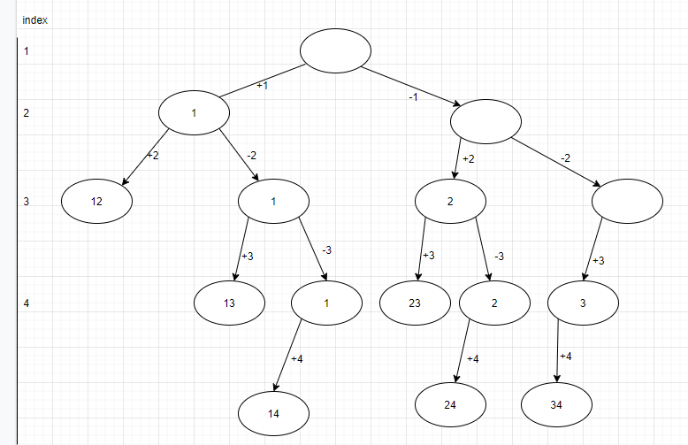

# 155. Combinations

Given two integers n and k, return all possible combinations of k numbers out of 1 ... n.

E.g.    Input: n = 4, k = 2

    Output: \[

                     \[2,4\],

                     \[3,4\],

                     \[2,3\],

                     \[1,2\],

                     \[1,3\],

                     \[1,4\]

        \]

### 解法\#1：

把这道题理解成找出所有长度为2的subset  在1234这个set里。



一共有n层，每层代表一个position

每层分2叉，左叉代表加当前position的element， 右叉代表不加。

当我们的pathPrefix里的值满足k个 的时间我们就可以把它加入到我们res里了，并且return。

#### 时间复杂度： 2叉n层， 所有是O\(2^n\)的时间复杂度。 空间是O\(n\)的， 因为有n层。

**Code:**

```java
public class Solution {
  public List<List<Integer>> combine(int n, int k) {
    // Write your solution here
    List<List<Integer>> res = new ArrayList<>();
    if(n < 0 || k < 0 || k > n){
      return res;
    }
    List<Integer> comb = new ArrayList<>();
    helper(1, n, k, comb, res);
    return res;
  }
  private void helper(int index, int n, int k, List<Integer> comb, List<List<Integer>> res){
    if(comb.size() == k){
      res.add(new ArrayList<Integer>(comb));
      return;
    }
    if(index > n){
      return;
    }
    comb.add(index);
    helper(index + 1, n, k, comb, res);
    comb.remove(comb.size() - 1);

    helper(index + 1, n, k, comb, res);
  }
}
```

### 解法\#2：


k层，每层代表一个output 的position

每层分【i，n】个叉。 这里 \[1, i） 为已经处理好的数， \[i,n\]为还没处理的数。

#### `Code:`

```java
public class Solution {
  public List<List<Integer>> combine(int n, int k) {
    // Write your solution here
    List<List<Integer>> res = new ArrayList<List<Integer>>();
    List<Integer> cur = new ArrayList<>();
    helper(res, cur, 1, n, k);
    return res;
  }
  private void helper(List<List<Integer>> res, List<Integer> cur, int start, int n, int k) {
    if(cur.size() == k ){
      res.add(new ArrayList<Integer>(cur));
      return;
    }
    for(int i = start; i <= n; i++){
      cur.add(i);
      helper(res, cur, i+1, n, k);
      cur.remove(cur.size() - 1);
    }
  }
}
```

**根据图上的recursion tree， 我们会发现4没有被用到。因为当i = 4 的时候，我们也只剩下4一个数可以用了，不满足k= 2 这个条件。 如果换一个栗子，n = 10， k = 6, 当i=6的时候， 剩余可以用的数为6，7，8，9，10， 这5个数，他们不管怎么组合都不能满足k=6这一条件。 所以我们可以优化我们打 i&lt;=n  to i&lt;=n-k+1. 这里的加1是因为我们最后要取到n，所以要+1。**

```java
public class Solution {
  public List<List<Integer>> combine(int n, int k) {
    // Write your solution here
    List<List<Integer>> res = new ArrayList<List<Integer>>();
    List<Integer> cur = new ArrayList<>();
    helper(res, cur, 1, n, k);
    return res;
  }
  private void helper(List<List<Integer>> res, List<Integer> cur, int start, int n, int k) {
    if(k == 0) {
      res.add(new ArrayList<Integer>(cur));
      return;
    }
    for(int i = start; i <= n - k + 1; i++){
      cur.add(i);
      helper(res, cur, i+1, n, k - 1);
      cur.remove(cur.size() - 1);
    }
  }

}
```

